<div align="center">
  
</div>

<br />

<div align="center">

# 你好，我是 HappyStupidChild 👻

### `开源探索者` · `数字工具收藏家` · `终身学习者`

喜欢发现、研究和整理有意思的开源项目。  
把好奇心变成一次次探索，把发现沉淀成自己的数字工具箱。

[](https://github.com/HappyStupidChild?tab=repositories)
[](https://github.com/HappyStupidChild?tab=stars)
[](https://github.com/HappyStupidChild/HappyStupidChild/actions)

</div>

---

## 🧭 关于我

```yaml
代号: HappyStupidChild
状态: 保持好奇，持续探索
关注领域:
  - AI 智能体与开发者工具
  - 自动化与命令行工作流
  - Android 系统与实用工具
  - 网络工具与自托管服务
当前目标: 在阅读、测试和实践中理解优秀开源项目
```

> 不追逐所有新技术，只认真研究真正有趣、实用、值得长期关注的东西。

## 🛰️ 探索坐标

<p align="center">
  <a href="https://github.com/HappyStupidChild?tab=stars&q=AI"></a>
  <a href="https://github.com/HappyStupidChild?tab=stars&q=Android"></a>
  <a href="https://github.com/HappyStupidChild?tab=stars&q=automation"></a>
  <a href="https://github.com/HappyStupidChild?tab=stars&q=CLI"></a>
  <a href="https://github.com/HappyStupidChild?tab=stars&q=network"></a>
</p>

## 🔭 我的开源雷达

<!-- AUTO:RADAR:START -->
<div align="center">

[](https://github.com/HappyStupidChild?tab=repositories)
[](https://github.com/HappyStupidChild?tab=repositories&type=fork)
[](https://github.com/HappyStupidChild?tab=stars)
[](./STAR-CATALOG.md)

</div>

### 我的仓库地图

<table>
  <tr>
    <td width="50%" valign="top">
      <h3>🤖 AI、智能体与研究</h3>
      <p><a href="https://github.com/HappyStupidChild/skillhub"><code>skillhub</code></a>
        &nbsp;·&nbsp;
        <a href="https://github.com/HappyStupidChild/claw-code"><code>claw code</code></a>
        &nbsp;·&nbsp;
        <a href="https://github.com/HappyStupidChild/claw-code-parity"><code>claw code parity</code></a>
        &nbsp;·&nbsp;
        <a href="https://github.com/HappyStupidChild/Deep_Learning-Notebook"><code>Deep Learning Notebook</code></a>
        &nbsp;·&nbsp;
        <a href="https://github.com/HappyStupidChild/iflow-cli"><code>iflow cli</code></a></p>
    </td>
    <td width="50%" valign="top">
      <h3>📱 Android 与移动生态</h3>
      <p><a href="https://github.com/HappyStupidChild/gkd"><code>gkd</code></a>
        &nbsp;·&nbsp;
        <a href="https://github.com/HappyStupidChild/Nrfr"><code>Nrfr</code></a>
        &nbsp;·&nbsp;
        <a href="https://github.com/HappyStupidChild/Shizuku"><code>Shizuku</code></a>
        &nbsp;·&nbsp;
        <a href="https://github.com/HappyStupidChild/v2rayNG"><code>v2rayNG</code></a></p>
    </td>
  </tr>
  <tr>
    <td width="50%" valign="top">
      <h3>🌐 网络、代理与下载</h3>
      <p><a href="https://github.com/HappyStupidChild/FlClash"><code>FlClash</code></a>
        &nbsp;·&nbsp;
        <a href="https://github.com/HappyStupidChild/v2rayN"><code>v2rayN</code></a>
        &nbsp;·&nbsp;
        <a href="https://github.com/HappyStupidChild/aria2.sh"><code>aria2.sh</code></a>
        &nbsp;·&nbsp;
        <a href="https://github.com/HappyStupidChild/Aria2-Explorer"><code>Aria2 Explorer</code></a>
        &nbsp;·&nbsp;
        <a href="https://github.com/HappyStupidChild/clash-verge-rev"><code>clash verge rev</code></a></p>
    </td>
    <td width="50%" valign="top">
      <h3>🖥️ Windows、运维与自动化</h3>
      <p><a href="https://github.com/HappyStupidChild/patch-edge-copilot"><code>patch edge copilot</code></a>
        &nbsp;·&nbsp;
        <a href="https://github.com/HappyStupidChild/Windows-Scripts"><code>Windows Scripts</code></a>
        &nbsp;·&nbsp;
        <a href="https://github.com/HappyStupidChild/tiktokmodcloud"><code>tiktokmodcloud</code></a>
        &nbsp;·&nbsp;
        <a href="https://github.com/HappyStupidChild/reinstall"><code>reinstall</code></a>
        &nbsp;·&nbsp;
        <a href="https://github.com/HappyStupidChild/HEU_KMS_Activator"><code>HEU KMS Activator</code></a></p>
    </td>
  </tr>
</table>

### Star 兴趣分布

| 分类 | 数量 | 代表项目 |
| --- | ---: | --- |
| 🤖 AI 智能体与开发工具 | 44 | LangChain、OpenCode、OpenClaw、Agent Skills |
| 🧠 大模型、RAG 与生成式 AI | 17 | DeepSeek、RAG-Anything、Open WebUI |
| 👁️ 计算机视觉与模型部署 | 36 | YOLO、PaddleDetection、MNN、LiteRT |
| 📚 数据集、论文与科研资料 | 25 | 数据集、科研代码、论文与调优手册 |
| 📱 Android 与移动生态 | 9 | Shizuku、GKD、ADB、QtScrcpy |
| 🌐 网络代理、下载与自托管 | 7 | Clash、v2ray、aria2、自托管服务 |
| 🖥️ Windows、系统与运维脚本 | 10 | Windows 脚本、ViVe、重装与运维工具 |
| ⚙️ 自动化、爬虫与效率工具 | 6 | EasySpider、CLI、下载与归档自动化 |
| 🧩 编程学习、设计与资源导航 | 5 | Build Your Own X、设计与学习资源 |
| 🎲 其他工具与兴趣项目 | 4 | 数据分析与实验性项目 |

<div align="center">
  <a href="./STAR-CATALOG.md"><strong>查看 163 个 Star 的完整分类目录 →</strong></a>
</div>

> 本区域由 GitHub Actions 自动维护。分类按项目的主要用途归档，具有交叉属性的项目只放入一个主分类。我的 19 个功能仓库均为 Fork，版权与成果属于原作者和贡献者。
<!-- AUTO:RADAR:END -->

## 🐍 贡献轨迹

<picture>
  <source media="(prefers-color-scheme: dark)" srcset="https://raw.githubusercontent.com/HappyStupidChild/HappyStupidChild/output/github-snake-dark.svg" />
  <source media="(prefers-color-scheme: light)" srcset="https://raw.githubusercontent.com/HappyStupidChild/HappyStupidChild/output/github-snake.svg" />
  
</picture>

## 🚀 最近在做

- 🔎 持续发现值得长期关注的开源项目
- 🧠 研究 AI 智能体与自动化工具的实现方式
- 🧰 整理跨平台的个人数字工具箱
- 🧪 把感兴趣的想法变成小实验

## 💡 我的原则

| 保持好奇 | 尊重原创 | 长期积累 |
| :---: | :---: | :---: |
| 对未知多问一个为什么 | 清楚标注来源与贡献 | 收藏只是开始，理解才有价值 |

---

<div align="center">
  <p><strong>梦想一点点，探索多一点，创造些有用的东西。</strong></p>
  <sub>⚡ 好奇心持续加载中…… ⚡</sub>
</div>
